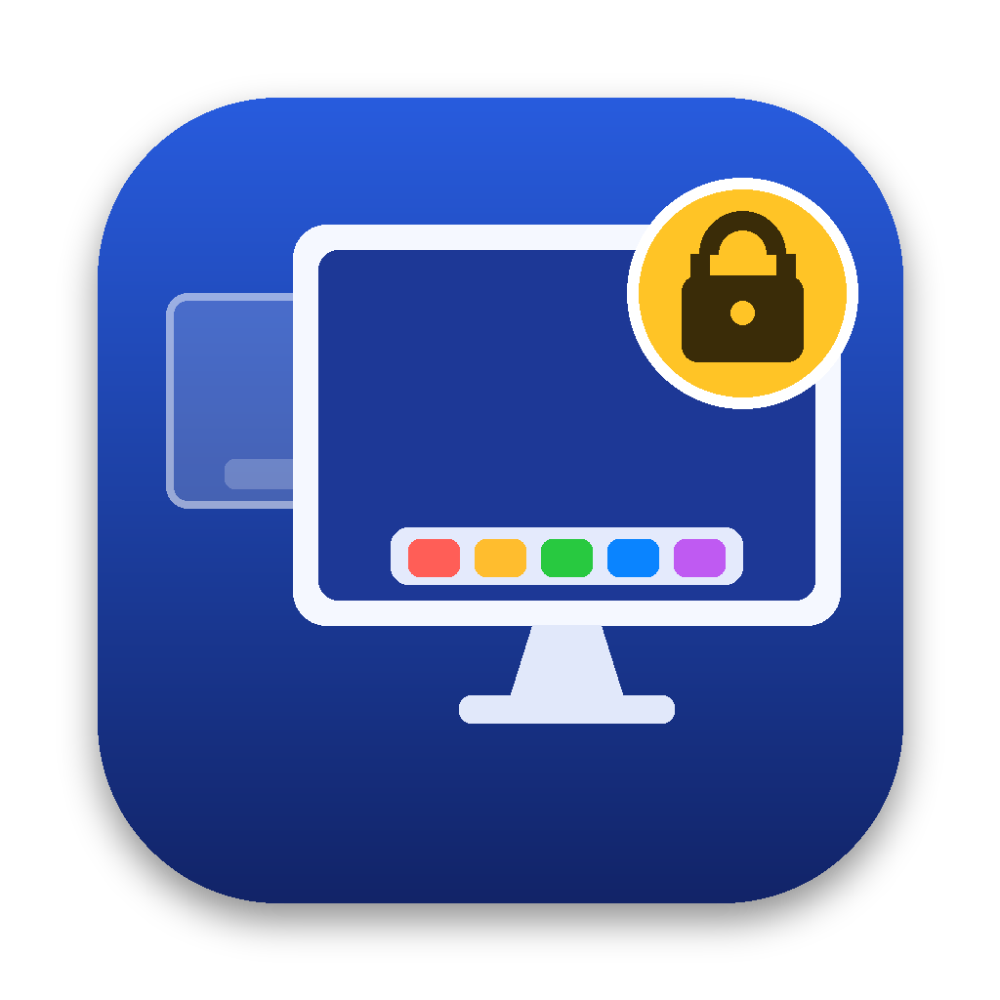
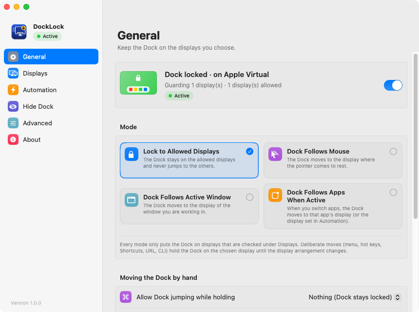
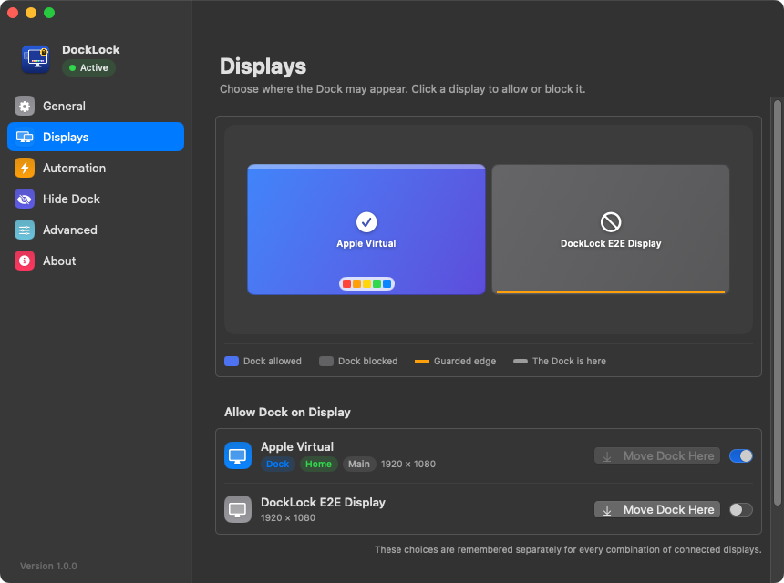
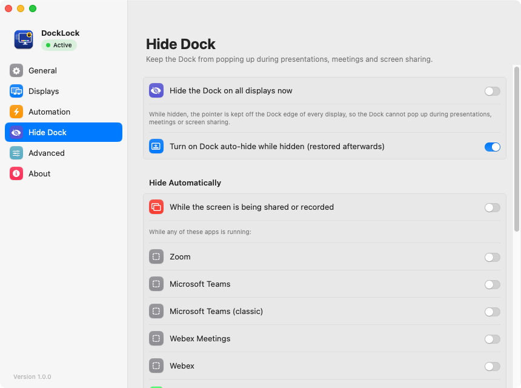

<p align="center"></p>

<h1 align="center">DockLock</h1>

<p align="center"><b>Keep the macOS Dock on the displays you choose.</b><br>
A free, open-source replacement for DockLock Lite / Plus / Pro.</p>

<p align="center">
  <a href="https://github.com/yihui-dev/docklock-yihui/actions/workflows/build.yml"></a>
  <a href="https://github.com/yihui-dev/docklock-yihui/releases"></a>
  <a href="LICENSE"></a>
  
  
</p>

<p align="center"><b>English</b> · <a href="README.zh-CN.md">简体中文</a></p>

<p align="center"></p>

---

## The problem

With more than one display, macOS moves the Dock to whichever screen your pointer touches at the bottom edge. Reach
for a window at the bottom of your laptop screen, and the Dock leaves your main monitor. During a presentation it
pops up on the shared screen.

**DockLock stops that.** It keeps the pointer a couple of points away from the Dock edge of every display the Dock
isn't allowed on, so macOS never gets the "push against the edge" that moves the Dock. Moving the pointer between
displays works as before. No system files are modified, SIP stays on, and there's no network access.

## Features

**Locking**
- Choose which displays may have the Dock. Your choice is remembered for **each combination of displays** (laptop
  alone, at the office, at home…).
- After sleep, display changes or a Dock restart, the Dock is **moved back automatically**, once the pointer is at
  rest and never while a menu is open.
- Hold a **modifier key** (⇧, ⌘, ⌥, ⌃ or a combination) to move the Dock on purpose.
- Stacked displays are handled: the shared edge between them stays open.
- Hot corners keep working. You can **pause** locking for 5 minutes, 15 minutes, an hour, or until resumed.

**Modes**
- **Lock to allowed displays.**
- **Dock follows mouse.** The Dock goes to the display where the pointer rests.
- **Dock follows active window.**
- **Dock follows apps when active.** Per-app rules: a fixed display, the app's window, or ignore.

**Hide the Dock**
- One click hides the Dock on every display, for presentations, meetings and recordings.
- It can happen automatically **while the screen is shared or recorded**, or while chosen apps run (Zoom, Teams, Webex,
  FaceTime, Tencent Meeting, Feishu, DingTalk, …).
- Optionally turns on macOS auto-hide while hiding, and restores it afterwards.

**Automation**
- Menu bar actions: move the Dock to any display, to the left/right/up/down, to the pointer, or home.
- **Global hot keys** for every action.
- **Apple Shortcuts & Siri**: all 22 DockLock Plus actions plus extras. Moves report success once the Dock has arrived.
- **URL scheme** `docklock://…`, which also accepts every `DockLockPlus://…` URL.
- **Command line** `docklock move left`, `docklock status --json`, … using the same syntax as the DockLock Plus CLI.
- **Raycast** script commands.

**Polish**
- A native settings window with a live display map, in light and dark mode.
- **10 languages**: English, 简体中文, 繁體中文, 日本語, 한국어, Deutsch, Français, Español, Português (Brasil), Русский.
  Choose one in Settings, or follow the system.

## Compared with DockLock

| | DockLock Lite | DockLock Plus | DockLock Pro¹ | **This app** |
|---|:-:|:-:|:-:|:-:|
| Lock the Dock to chosen displays, per display arrangement | ✓ | ✓ | ✓ | ✓ |
| Move the Dock back after sleep / display changes | ✓ | ✓ | ✓ | ✓ |
| Hide the Dock during meetings / screen sharing | ✓ | ✓ | ✓ | ✓ **+ automatic detection** |
| Modifier key to move the Dock on purpose | paid add-on | ✓ | ✓ | ✓ |
| Hide menu bar / Dock icon, launch at login | paid add-on | ✓ | ✓ | ✓ |
| Dock follows mouse / active window / apps | – | ✓ | ✓ | ✓ |
| Shortcuts & Siri | – | ✓ | ✓ | ✓ |
| URL scheme | – | `DockLockPlus://` | ✓ | `docklock://` + **`DockLockPlus://`** |
| Command line | – | ✓ | ✓ | ✓ (compatible) |
| Raycast | – | extension | ✓ | script commands |
| Built-in global hot keys | – | via Shortcuts | ✓ | ✓ |
| Pause, hot-corner support | – | – | – | ✓ |
| Price | subscription | one-time | TBA | **free, MIT** |

¹ DockLock Pro was announced but not yet released when DockLock was written. Its "vertical Dock on any display"
feature relies on private reverse-engineered internals and isn't included here.

## Install

**Download:** grab `DockLock.dmg` from [Releases](https://github.com/yihui-dev/docklock-yihui/releases) and drag DockLock
into Applications. Builds are signed ad hoc rather than notarized, so on first launch right-click the app › **Open**,
or run:

```bash
xattr -dr com.apple.quarantine /Applications/DockLock.app
```

**Build from source** (Xcode 15+):

```bash
git clone https://github.com/yihui-dev/docklock-yihui.git
cd docklock-yihui
Scripts/build.sh --install        # or open DockLock.xcodeproj and press ⌘R
```

Requires macOS 13 or later and *System Settings › Desktop & Dock › Displays have separate Spaces* turned on (the
default).

## Quick start

1. Open DockLock and **allow Accessibility access** when asked. The settings window walks you through it.
2. In the menu bar menu, under **Allow Dock on Display**, check the display(s) the Dock should stay on.
3. Done. The Dock won't jump to the other displays any more.

📖 **Everything else** (modes, hot keys, recipes, the full URL/CLI reference, troubleshooting) is in the
**[User Guide](docs/usage.md)**.

<p align="center">
  
  
</p>

## Automation at a glance

```bash
open "docklock://moveToDisplay?name=Studio%20Display"   # URL scheme (DockLockPlus:// works too)
docklock move left                                       # CLI — waits until the Dock has arrived
docklock mode follows-mouse
docklock hide on
docklock status --json
```

In the Shortcuts app, search for **DockLock**. See the [User Guide](docs/usage.md#automation-reference) for every
command.

## How it works

| Part | What it does |
|---|---|
| **Edge guard** | A session event tap (`PointerGuard`, on its own thread) moves pointer events that land in the last 2–3 points of a guarded display's Dock edge back by that much. Only free edges are guarded, never the strip where displays touch. Each event costs a few comparisons. |
| **Finding the Dock** | `CoreDockGetRect` (resolved at runtime, with an Accessibility fallback) plus geometry decide which display hosts the Dock. |
| **Moving the Dock** | When the pointer is idle, DockLock briefly pushes against the target display's Dock edge using IOKit HID relative motion, which takes the same path as a real mouse. It confirms where the Dock actually is and puts the pointer back. |
| **Tests** | CI builds the app and creates a *virtual second display* on a macOS runner. It then verifies the guard, hiding, automatic moves and follow mode end to end. |

Details: [docs/ARCHITECTURE.md](docs/ARCHITECTURE.md).

## FAQ

**Does it need any special permission?** Only **Accessibility**, which is required to adjust pointer events. It doesn't
read your keystrokes (only modifier state) and has no network access.

**Will it conflict with DockLock Lite/Plus?** Yes, two lockers fight over the Dock. DockLock offers to quit them when
it starts.

**The Dock still jumps after an update.** macOS keeps the old build's permission. Remove DockLock from *Privacy &
Security › Accessibility* and add it again.

**Why does Cmd+Tab show on the other display?** The app switcher always follows the Dock. That's how macOS works.

More in the [User Guide](docs/usage.md#troubleshooting).

## Contributing

Issues and pull requests are welcome, and so are translations. Please read [CONTRIBUTING.md](CONTRIBUTING.md) and
the [Code of Conduct](CODE_OF_CONDUCT.md). Report security problems privately as described in
[SECURITY.md](SECURITY.md). Changes are listed in [CHANGELOG.md](CHANGELOG.md).

DockLock is an independent open-source project and isn't affiliated with the makers of DockLock Lite/Plus/Pro.

## License

[MIT](LICENSE) © yihui-dev and DockLock contributors
