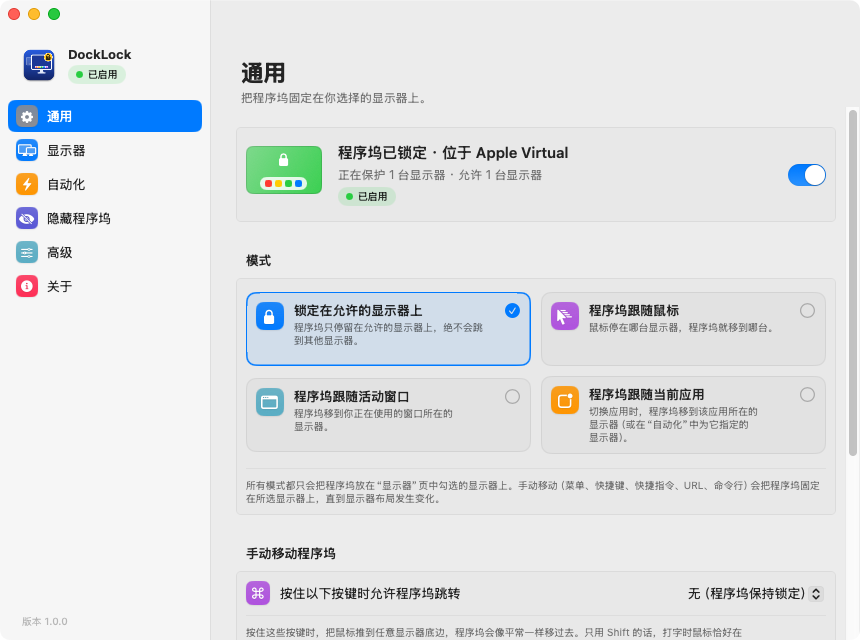
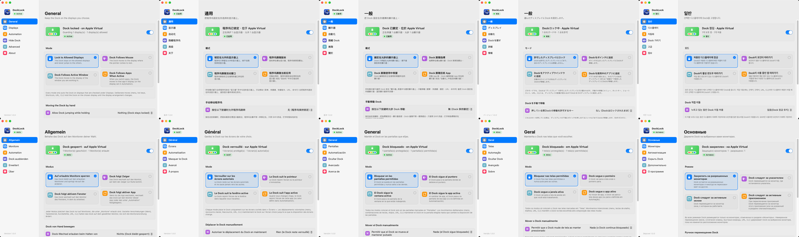
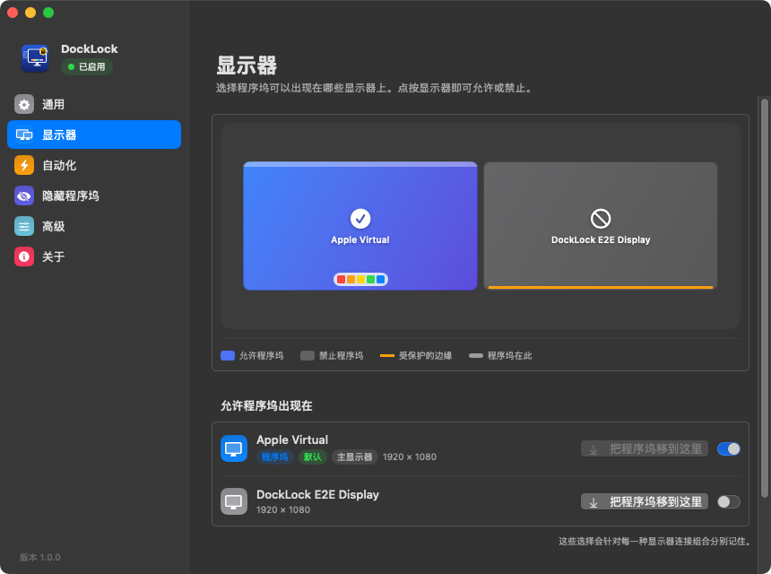
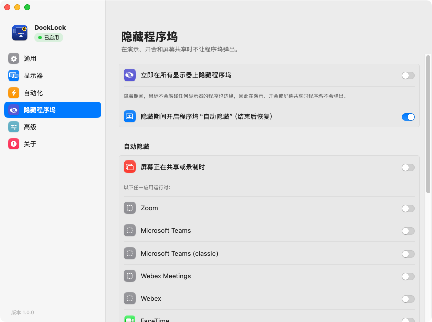

<p align="center"></p>

<h1 align="center">DockLock</h1>

<p align="center"><b>把 macOS 程序坞固定在你选择的显示器上。</b><br>
免费、开源的 DockLock Lite / Plus / Pro 替代品。</p>

<p align="center">
  <a href="https://github.com/yihui-dev/docklock-yihui/actions/workflows/build.yml"></a>
  <a href="https://github.com/yihui-dev/docklock-yihui/releases"></a>
  <a href="LICENSE"></a>
  
  
</p>

<p align="center"><a href="README.md">English</a> · <b>简体中文</b></p>

<p align="center"></p>

---

## 解决什么问题

接了多台显示器时，鼠标一碰到哪台显示器的底边，macOS 就把程序坞搬到哪台。想点笔记本屏幕底部的窗口，程序坞就跑了；演示时它又会突然出现在共享的屏幕上。

**DockLock 能阻止这种情况。** 它让鼠标在不允许放程序坞的显示器上始终离程序坞边缘 2–3 个点，macOS 收不到“顶住边缘”的动作，也就不会搬动程序坞。鼠标在显示器之间照常穿行。不修改系统文件、不关闭 SIP、不联网。

## 功能

**锁定**
- 选择哪些显示器可以放程序坞，**每种显示器组合**（只有笔记本、办公室、家里…）分别记住设置。
- 睡眠唤醒、插拔显示器、程序坞重启后**自动移回**：等鼠标静止才移动，菜单打开时不会移动。
- 按住**修饰键**（⇧ / ⌘ / ⌥ / ⌃ 或组合）时可以有意移动程序坞。
- 支持上下堆叠的显示器：两屏相接的边缘保持畅通。
- 保留触发角。可以**暂停**锁定 5 分钟、15 分钟、1 小时，或直到手动恢复。

**模式**
- **锁定在允许的显示器上**。
- **程序坞跟随鼠标**：鼠标停在哪台显示器，程序坞就去哪台。
- **程序坞跟随活动窗口**。
- **程序坞跟随当前应用**：可按应用设置规则，指定固定显示器、跟随应用窗口或忽略。

**隐藏程序坞**
- 一键在所有显示器上隐藏程序坞，适合演示、开会、录屏。
- 可以**在屏幕共享 / 录屏时**或指定应用运行时（Zoom、Teams、Webex、FaceTime、腾讯会议、飞书、钉钉…）自动隐藏。
- 可选在隐藏期间临时打开系统的“自动隐藏”，结束后恢复。

**自动化**
- 菜单栏操作：把程序坞移到任意显示器、左 / 右 / 上 / 下的显示器、鼠标所在的显示器或默认显示器。
- 每个操作都能设**全局快捷键**。
- **快捷指令与 Siri**：包含 DockLock Plus 全部 22 个动作，外加额外动作。移动类动作会在程序坞真正移过去后才返回成功。
- **URL Scheme** `docklock://…`，也兼容所有 `DockLockPlus://…` 链接。
- **命令行** `docklock move left`、`docklock status --json`……语法与 DockLock Plus 的 CLI 相同。
- **Raycast** 脚本命令。

**体验**
- 原生设置窗口，带实时显示器布局图，支持浅色和深色模式。
- **10 种语言**：English、简体中文、繁體中文、日本語、한국어、Deutsch、Français、Español、Português (Brasil)、Русский。可以在设置里选择，也可以跟随系统。

<p align="center"></p>

## 与 DockLock 对比

| | DockLock Lite | DockLock Plus | DockLock Pro¹ | **本应用** |
|---|:-:|:-:|:-:|:-:|
| 把程序坞锁定在指定显示器（按显示器组合记住） | ✓ | ✓ | ✓ | ✓ |
| 睡眠唤醒 / 显示器变化后移回程序坞 | ✓ | ✓ | ✓ | ✓ |
| 开会 / 屏幕共享时隐藏程序坞 | ✓ | ✓ | ✓ | ✓ **+ 自动检测** |
| 按修饰键有意移动程序坞 | 付费附加 | ✓ | ✓ | ✓ |
| 隐藏菜单栏 / 程序坞图标、开机启动 | 付费附加 | ✓ | ✓ | ✓ |
| 跟随鼠标 / 活动窗口 / 应用 | – | ✓ | ✓ | ✓ |
| 快捷指令与 Siri | – | ✓ | ✓ | ✓ |
| URL Scheme | – | `DockLockPlus://` | ✓ | `docklock://` + **`DockLockPlus://`** |
| 命令行 | – | ✓ | ✓ | ✓（兼容） |
| Raycast | – | 扩展 | ✓ | 脚本命令 |
| 内置全局快捷键 | – | 需借助快捷指令 | ✓ | ✓ |
| 暂停、保留触发角 | – | – | – | ✓ |
| 价格 | 订阅 | 买断 | 未公布 | **免费，MIT 开源** |

¹ 编写 DockLock 时 DockLock Pro 还没有发布。它的“竖直程序坞可放任意显示器”依赖逆向私有接口，本项目没有实现。

## 安装

**下载**：从 [Releases](https://github.com/yihui-dev/docklock-yihui/releases) 下载 `DockLock.dmg`，把 DockLock 拖到“应用程序”。构建是临时签名的，没有经过苹果公证，第一次打开请右键 › **打开**，或执行：

```bash
xattr -dr com.apple.quarantine /Applications/DockLock.app
```

**从源码编译**（需要 Xcode 15+）：

```bash
git clone https://github.com/yihui-dev/docklock-yihui.git
cd docklock-yihui
Scripts/build.sh --install        # 或用 Xcode 打开 DockLock.xcodeproj 按 ⌘R
```

需要 macOS 13 或更高版本，并保持 *系统设置 › 桌面与程序坞 › 显示器具有单独的空间* 打开（默认就是打开的）。

## 快速开始

1. 打开 DockLock，按提示**授予“辅助功能”权限**（设置窗口会一步步引导）。
2. 在菜单栏菜单的 **允许程序坞出现在** 下，勾选程序坞要停留的显示器。
3. 完成。程序坞不会再跳到其他显示器了。

📖 **更多内容**（模式、快捷键、常见用法、完整的 URL / 命令行参考、故障排除）请看 **[使用指南](docs/usage.zh-CN.md)**。

<p align="center">
  
  
</p>

## 自动化速览

```bash
open "docklock://moveToDisplay?name=Studio%20Display"   # URL Scheme（DockLockPlus:// 也可以）
docklock move left                                       # 命令行：等程序坞真正移过去才返回
docklock mode follows-mouse
docklock hide on
docklock status --json
```

在“快捷指令”App 中搜索 **DockLock** 即可使用快捷指令动作。全部命令见 [使用指南](docs/usage.zh-CN.md#自动化参考)。

## 工作原理

| 部分 | 做什么 |
|---|---|
| **边缘防护** | 独立线程上的会话级事件监听（`PointerGuard`）。落进受保护显示器程序坞边缘最后 2–3 个点的鼠标事件，会被拉回这么多。只防护自由边缘，显示器相接的那段绝不拦截。每个事件只做几次比较。 |
| **定位程序坞** | 通过 `CoreDockGetRect`（运行时查找，失败时退回辅助功能接口）加几何计算，判断程序坞在哪台显示器上。 |
| **移动程序坞** | 趁鼠标静止，用 IOKit HID 相对位移（与真实鼠标走同一条路径）在目标显示器边缘“顶”一下，然后确认程序坞的实际位置，并把鼠标放回原处。 |
| **测试** | CI 在 macOS 上编译应用，并创建一台**虚拟第二显示器**，端到端验证边缘防护、隐藏、自动移动和跟随鼠标。 |

详见 [docs/ARCHITECTURE.zh-CN.md](docs/ARCHITECTURE.zh-CN.md)。

## 常见问题

**需要什么权限？** 只需要**辅助功能**权限，用来调整鼠标事件。不读取键盘输入（只读取修饰键状态），也不联网。

**会和 DockLock Lite / Plus 冲突吗？** 会，两个锁定工具会互相冲突。DockLock 启动时会提示你退出它们。

**更新后程序坞又乱跳了？** macOS 保留的是旧版本的授权。在 *隐私与安全性 › 辅助功能* 里把 DockLock 删掉再重新添加。

**为什么 Cmd+Tab 切换器出现在另一台显示器上？** 应用切换器总是跟着程序坞走，这是 macOS 的行为。

更多见 [使用指南](docs/usage.zh-CN.md#故障排除)。

## 参与贡献

欢迎提交 Issue、PR 和翻译！请先阅读 [贡献指南](CONTRIBUTING.md) 和 [行为准则](CODE_OF_CONDUCT.md)。安全问题请按 [SECURITY.md](SECURITY.md) 私下报告。版本变化见 [CHANGELOG.md](CHANGELOG.md)。

DockLock 是独立的开源项目，与 DockLock Lite / Plus / Pro 的开发者没有关联。

## 许可证

[MIT](LICENSE) © yihui-dev and DockLock contributors
